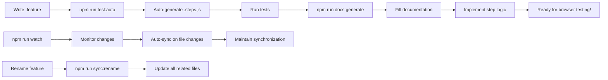

# Cats Scared Of Cucumbers

<div align="center">
    
</div>

Example BDD Framework, Generated by Copilot

## 🚀 Quick Start

1. **Write a feature file**:
   ```gherkin
   Feature: User login
     Scenario: Successful login
       Given I am on the login page
       When I enter valid credentials
       Then I should be logged in
   ```

2. **Auto-generate everything**:
   ```bash
   npm run test:auto        # Generates step definitions and runs tests
   npm run docs:generate    # Creates documentation template
   ```

3. **Implement and document**: Fill in the step logic and complete the documentation.

## 📁 Project Structure

```
├── features/
│   ├── login.feature                    # Gherkin feature files
│   ├── navigation.feature
│   └── step_definitions/
│       ├── login.steps.js               # Feature-specific step definitions
│       └── navigation.steps.js
├── docs/
│   ├── README.md                        # Documentation index and navigation
│   ├── features/                        # BDD feature documentation
│   │   ├── login.md                     # Individual feature docs
│   │   └── navigation.md
│   └── framework/                       # Testing framework documentation
│       ├── AUTO_STEPS.md                # Auto-generation guide
│       ├── architecture.md              # Framework design
│       └── browser-automation.md        # Browser testing best practices
├── scripts/
│   ├── auto-generate-steps.js           # Auto-generation logic
│   ├── generate-docs.js                 # Documentation generation
│   ├── sync-features.js                 # File synchronization
│   ├── watch-features.js                # Real-time monitoring
│   ├── rename-feature.js                # Safe feature renaming
│   └── check-docs.js                    # Documentation coverage
└── .instructions.md                     # AI assistant guidelines
```

## 🛠️ Available Commands

| Command | Purpose |
|---------|---------|
| `npm run test:auto` | **Main workflow**: Auto-generate steps + run tests |
| `npm run auto-generate-steps` | Generate missing step definitions only |
| `npm run docs:generate` | Create documentation stubs for undocumented features |
| `npm run docs:check` | Check documentation coverage and status |
| `npm run sync:check` | Check synchronization between features, steps, and docs |
| `npm run sync:clean` | Remove orphaned step definitions and documentation |
| `npm run sync:rename <old> <new>` | Rename a feature and all related files |
| `npm run watch` | Watch for feature file changes and auto-sync |
| `npm test` | Run Cucumber tests normally |
| `npm run migrate-steps` | Helper to migrate from monolithic step files |

## ✨ Key Features

### 🔄 Automatic Step Generation
- **Never see undefined steps again**: Automatically generates step definition files
- **Feature-specific organization**: Each `.feature` file gets its own `.steps.js` file
- **Smart parsing**: Associates steps with their source features
- **Duplicate prevention**: Won't recreate existing step definitions

### 🔄 Automatic Synchronization
- **File watching**: Auto-sync when features are added, modified, or deleted with `npm run watch`
- **Orphan detection**: Identifies and cleans up step definitions and docs without corresponding features
- **Rename support**: Safely rename features and all related files with `npm run sync:rename`
- **Status monitoring**: Track synchronization status across all files with `npm run sync:check`

### 📚 Built-in Documentation
- **Auto-generated templates**: Creates structured documentation for every feature in `docs/features/`
- **Categorized organization**: Separates feature docs from framework docs in `docs/framework/`
- **Consistent format**: Standardized documentation structure across all features
- **Coverage tracking**: Built-in documentation status monitoring with `npm run docs:check`
- **Browser compatibility tracking**: Built-in compatibility matrices
- **Troubleshooting guides**: Template sections for common issues and solutions

### 🎯 Browser Testing Ready
- **Modern automation patterns**: Async/await, Page Object Model support
- **Cross-browser compatibility**: Chrome, Firefox, Safari, Edge support
- **Best practices baked in**: Error handling, waits, assertions
- **Scalable architecture**: Organized for large test suites

## 🔧 Integration with AI Assistants

This project includes `.instructions.md` for VS Code Copilot integration, ensuring AI assistants:
- ✅ Always run `npm run test:auto` after creating features
- ✅ Implement step definitions using browser automation best practices
- ✅ Create comprehensive documentation for every feature
- ✅ Follow modern JavaScript and BDD patterns

## 📖 Documentation

- **[Documentation Index](docs/README.md)**: Central hub for all documentation
- **[Feature Documentation](docs/features/)**: Individual BDD feature guides  
- **[Framework Documentation](docs/framework/)**: Testing framework internals
- **[Auto-Generation Guide](docs/framework/AUTO_STEPS.md)**: Detailed guide on automatic generation
- **[AI Instructions](.instructions.md)**: Guidelines for AI coding assistants

## 🎯 Workflow



## 🌟 Benefits

- **🚀 Faster development**: No manual step definition boilerplate
- **🧹 Clean organization**: Feature-specific files prevent merge conflicts  
- **📝 Built-in documentation**: Every feature is automatically documented
- **🔄 Auto-synchronization**: Files stay in sync automatically
- **🤖 AI-friendly**: Optimized for AI pair programming
- **🔧 Maintainable**: Scalable structure for large test suites
- **🌐 Browser-ready**: Modern automation patterns included

## 🔮 Next Steps

Ready to start writing browser tests? Check out the [AI Instructions](.instructions.md) to see how this framework guides AI assistants in implementing comprehensive browser automation tests using modern tools like Playwright or Selenium.

---

Built for teams who want to focus on writing great tests, not managing boilerplate code.
